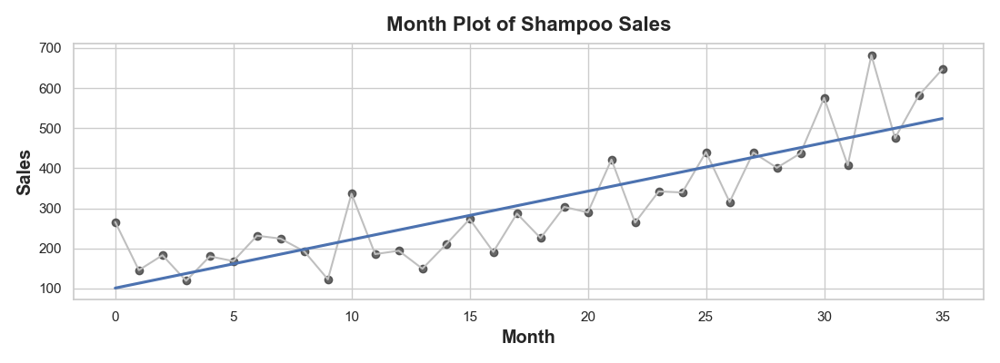
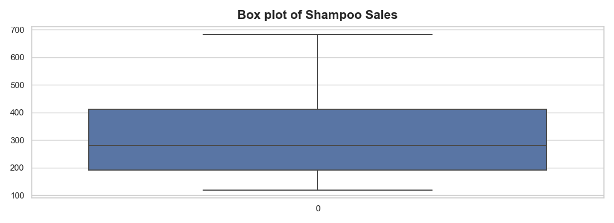
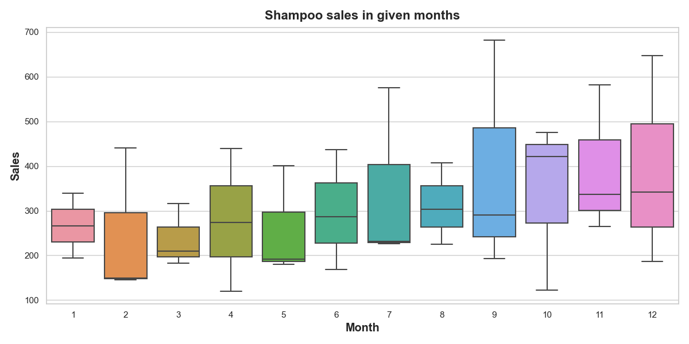
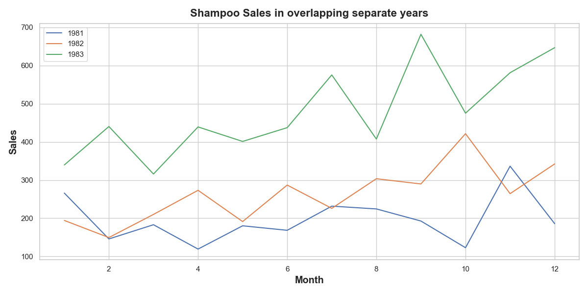
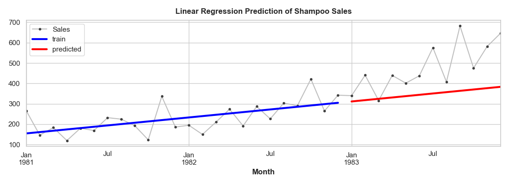
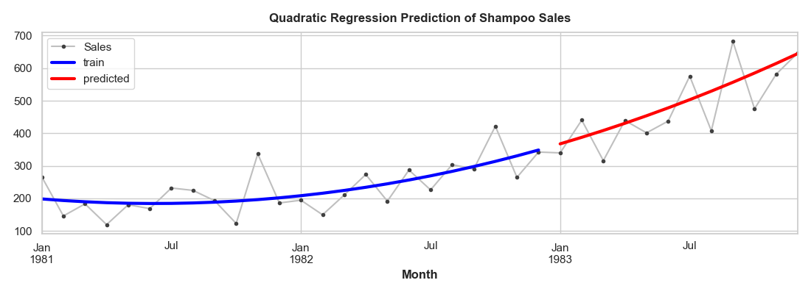
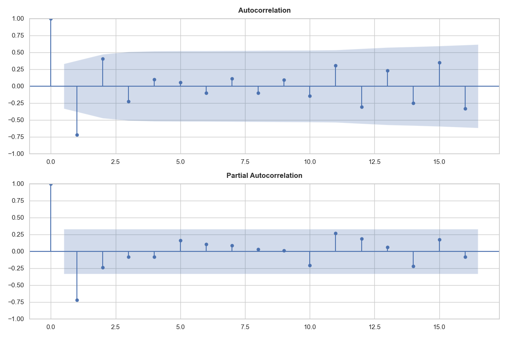
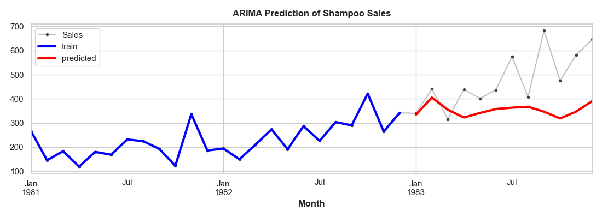

# Predikce časových řad - Shampoo Sales dataset


## Obsah

- [Úvod do problematiky](#úvod-do-problematiky)
- [Použité nástroje](#použité-nástroje)
- [Představení datasetu](#představení-datasetu)
- [Načtení a transformace dat](#načtení-a-transformace-dat)
- [Analýza dat](#analýza-dat)
- [Lineární regrese](#lineární-regrese)
- [Kvadratická regrese](#kvadratická-regrese)
- [Model ARIMA](#model-arima)


## Úvod do problematiky 
Predikce časových řad je klíčovým nástrojem v mnoha oblastech, jako jsou finance, meteorologie, výroba a další. Umožňuje nám předpovídat budoucí hodnoty na základě historických dat, což může být nesmírně užitečné při rozhodování a plánování. V tomto článku se zaměříme na predikci časové řady na příkladu datasetu „shampoo sales“, který obsahuje měsíční prodeje šamponu. Pro tuto úlohu použijeme několik různých modelů a zhodnotíme jejich výkon.

## Použité nástroje
Veškerou práci s daty provádíme pomocí programovacího jazyka `Python`. Pro načtení dat a vytvoření objektu datového rámce využijeme modul `Pandas`. Pro vizualizaci datových analýz a výsledků predikce využijeme modul `Matplotlib` a `Seaborn`. Pro vykonávání početních operací nad daty využijeme modul `Numpy`. Pro tvorbu prediktivních modelů a jejich vyhodnocení využijeme modul `Scikit-learn`.

## Představení datasetu

- **Název datasetu:** shampoo_sales.csv
- **Velikost datasetu:** 484 B
- **Sloupce:** Month, Sales
- **Zdroj:** Kaggle.com

Tento dataset popisuje měsíční prodeje šampónů za období 3 let. Jednotkou je počet prodejů pro každý ze 36 záznamů. Sloupec `Month` je ve formátu `datetime64` a sloupec `Sales` je ve formátu `int64`. Původní dataset pochází od Makridakis, Wheelwright a Hyndman (1998).

## Načtení a transformace dat


### Načtení dat
Nejprve si načteme pomocí modulu `Pandas` dataset ve formátu `*.csv` do objektu datového rámce. Zároveň si necháme vypsat data za prvních 12 měsíců, čímž zkontrolujeme, zda se nám data správně načetla.

```python
df = pd.read.csv('shampoo_sales.csv',
		 index_col='Month')

df.show(12)
```


| Month | Sales |
|-------|-------|
| 1-01  | 266.0 |
| 1-02  | 145.9 |
| 1-03  | 183.1 |
| 1-04  | 119.3 |
| 1-05  | 180.3 |
| 1-06  | 168.5 |
| 1-07  | 231.8 |
| 1-08  | 224.5 |
| 1-09  | 192.8 |
| 1-10  | 122.9 |
| 1-11  | 336.5 |
| 1-12  | 185.9 |

### Transformace hodnot indexu `Month`

Hodnoty indexového sloupce `Month` neodpovídají daným rokům, ve kterých byla data zaznamenána. Víme, že data byla pořízována od začátku roku 1981 do konce roku 1983. Jednotlivé záznamy změníme pomocí jednoduché funkce `custom_date_parser()`.

```Python
def custom_date_parser(date):
    year = 1981 + int(date.split('-')[0]) - 1
    month = int(date.split('-')[1])
    return pd.to_datetime(f'{year}-{month:02}')

df.index = df.index.to_series().apply(custom_date_parser)
```

### Převedení indexu na periodu

Pro další analýzu a práci s časovou řadou je ještě vhodné použít přesný časový rámec pomocí metody `to_period()`. To se hodí zejména pro snadnou agregaci dat podle časového intervalu. Je zajištěno, že jednotlivé hodnoty jsou brány za dané období a ne ke konkrétnímu dni. Zároveň intervaly mezi jednotlivými záznamy zůstávají konzistentní, díky čemuž můžeme analyzovat trendy a sezónnost. Tento formát sloupce je také vhodnější pro následnou vizualizaci dat.

```Python
df = df.to_period()

df.head()
```

| Month   | Sales |
|---------|-------|
| 1981-01 | 266.0 |
| 1981-02 | 145.9 |
| 1981-03 | 183.1 |
| 1981-04 | 119.3 |
| 1981-05 | 180.3 |


## Analýza dat

### Základní statistika

Pro získání základní popisné statistiky pro numerický sloupec `Sales` v datovém rámci použijeme funkci `describe()`. Získáme tak počet hodnot, průměrnou hodnotu, směrodatnou odchylku, minimální a maximální hodnotu, medián a první a třetí kvartil.

```Python
df.describe()
```

| Sales |        |
|-------|--------|
| count | 36.0   |
| mean  | 312.6  |
| std   | 148.94 |
| min   | 119.3  |
| 25%   | 192.45 |
| 50%   | 280.15 |
| 75%   | 411.1  |
| max   | 682.0  |

Na základě počtu hodnot `36` můžeme usoudit, že naše data jsou kompletní a obsahují všechny záznamy v rozmezíi *3* let.

Směrodatná odchylka nám ukazuje míru variability, popř. jak velké je rozptýlení hodnot kolem průměrné hodnoty. Hodnota `148.94` nám ukazuje, že jednotlivé prodeje se od průměru značně liší. To u časové řady může znamenat, že na hodnoty může mít vliv sezónnost nebo časová závislost dané hodnoty na předchozí hodnotě (sériová závislost). Jsou to tedy první indicie, kudy se vydat v dalším vyhodnocení dat.

### Test stacionarity

Pomocí `ADF` (Augmented Dickey-Fuller) testu zkontrolujeme zda je naše časová řada stacionární.

```Python
from statsmodels.tsa.stattools import adfuller

result = adfuller(df['Sales'])
print('ADF Statistic:', result[0])
print('p-value:', result[1])
```

- **ADF Statistic:** 3.0601420836411806
- **p-hodnota:** 1.0

*ADF* je obecně vyšší než běžně udávané kritické hodnoty, což naznačuje, že naše řada není stacionární. To znamená, že statistické vlastnosti této časové řady se mění v čase, což může ovlivnit analýzu a predikci. To nám tedy říká, že budeme dále muset aplikovat diferenciaci nebo další transformace, čímž učiníme řadu stacionární.

*P-hodnota* je také extrémně vysoká, což naznačuje, že existuje vysoká pravděpodobnost, že nulová hypotéza je pravdivá. Jinými slovy, časová řada není stacionární. To nám také potvrzuje nutnost dalšího zpracování dat směrem k jejich stacionarizaci.

### Základní Vizualizace dat

Nyní si pomocí modulu `Matplotlib` vygenerujeme první vizualizaci dat, která nám poskytne daleko lepší představu o tom, jak data celkově vypadají. Zároveň si pomocí funkce `regplot()` proložíme trendovou linii (lineární regrese) dat do grafu (modře). V grafu vidíme, že trend je vzestupný a vcelku dobře vystihuje okolní data. Kvadratická regrese by ale mohla chování dat kopírovat přesněji. Zkusím tedy kvadratickou regresi v pozdějším kroku namodelovat.

```Python
fig, ax = plt.subplots()
ax.plot('Month', 'Sales', data=df, color='0.75')
ax = sns.regplot(x='Month', y='Sales', data=df, ci=None, scatter_kws=dict(color='0.25'))
ax.set_title('Month Plot of Shampoo Sales')
fig.savefig('basic_plot.png')
```



Pomocí `Boxplot` grafu můžeme dále zkontrolovat, zda naše data neobsahují odlehlé hodnoty. Na následujícím grafu vidíme rozložení dat mezi jednotlivými kvartily s polohou mediánu. Odlehlé hodnoty se zde nevyskytují.



### Pokročilá vizualizace dat

Vzhledem k tomu, že data jsou sezónní, je vhodně si je vizualizovat ve vztahu k unikátním měsícům v roce. Na to použijeme opět `Boxplot`, který je užitečný k vizualizaci sezónních vzorců. V grafu vidíme rozptyl prodejů v jednotlivých měsících. Zde začíná být zřejmé, že prodeje se zvyšují více tím, jak se přibližují ke konci roku, zároveň se ale zvětšuje jejich rozptyl.



Na základě předchozího grafu je zřejmé, že data prodejů vykazují jistou roční sezónnost. Může být tedy užitečné si vykreslit jednotlivé roky přes sebe. Zde je vidět, že opravdu ke konci každého roku prodeje narůstají. Je zde ale i patrné, že jednotlivé roky se liší v absolutních hodnotách a zároveň je zde i zřejmá jistá nestacionarita.



## Příprava dat pro prediktivní model

Abychom mohli dála na datech natrénovat a následně otestovat prediktivní model, musíme si data rozdělit na trénovací a testovací část. Pro trénink modelu použijeme první dva roky prodejů (první 2/3) a pro testování poslední rok prodejů (poslední 1/3). Pro rozdělení datasetu použijeme použijeme funkci `train_test_split()` z knihovny `scikit-learn`.

```Python
# Training data
X = df.loc[:, ['Month']] # features
y = df.loc[:, 'Sales'] # target

X_train, X_test, y_train, y_test = train_test_split(X,y, test_size=0.33, shuffle=False)
```

## Lineární regrese

Pomocí modelu lineární regrese natrénujeme na trénovacích datech prediktivní model.

```Python
# Train model
model = LinearRegression()
model.fit(X_train,y_train)
```

Nyní provedeme samotnou predikci hodnot prodeje pomocí modelu lineární regrese ve stejném rozsahu jako naše testovací data.

```Python
y_test_pred = pd.Series(model.predict(X_test), index=X_test.index)
```

Jako hodnotící kritérium zvolíme metriku `MAE` (Mean Average Error)

```Python
from sklearn.metrics import mean_absolute_error

mae = mean_absolute_error(y_test, y_pred)
print('Mean Absolute Error (MAE):', mae)
```

*Mean Absolute Error (MAE): `132.71`*




Lineární regrese je nejjednodušší model pro predikci časové řady, zároveň je ale vidět, že v tomto případě nejsou predikce odpovídající hodnotám v testovacím rozsahu. Tento prediktivní model již podle vizuální kontroly hodnotíme jako nevhodný. Zároveň průměrná absolutní chyba je také dosti velká.

## Kvadratická regrese

Jako další sloupec přidáme do datasetu pomocí deterministického procesu `Determinstic_process` časový polynom druhého řádu, na kterém poté natrénujeme model pro lineární regresi.

```Python
dp = DeterministicProcess(
    index=X.index,
    constant=True,
    order=2,
    drop=True,
)

X = dp.in_sample()

X.head()
```

| Month   | const | trend | trend_squared |
|---------|-------|-------|---------------|
| 1981-01 | 1.0   | 1.0   | 1.0           |
| 1981-02 | 1.0   | 2.0   | 4.0           |
| 1981-03 | 1.0   | 3.0   | 9.0           |
| 1981-04 | 1.0   | 4.0   | 16.0          |
| 1981-05 | 1.0   | 5.0   | 25.0          |

Po rozdělení dat na tréninkovou a testovací část na těchto datech natrénujeme náš model.

```Python
X_train, X_test, y_train, y_test = train_test_split(X,y, test_size=0.33, shuffle=False)

model = LinearRegression(fit_intercept=False)
model.fit(X_train, y_train)
```

Na natrénovaném modelu odvodíme naší predikci.

```Python
y_train_pred = pd.Series(model.predict(X_train), index=X_train.index)

y_test_pred = pd.Series(model.predict(X_test), index=X_test.index)
```

```Python
from sklearn.metrics import mean_absolute_error

mae = mean_absolute_error(y_test, y_pred)
print('Mean Absolute Error (MAE):', mae)
```

*Mean Absolute Error (MAE): `61.62`*



Tato predikce již vypadá velice dobře. MAE je oproti lineární regresi prvního řádu poloviční. Tento trend využijeme dále pro stacionarizaci dat, která je nutná pro použití prediktivního modelu ARIMA.


## Model ARIMA

Z předchozí analýzy dat víme, že data nejsou stacionární. Abychom mohli použít prediktivní model ARIMA, musíme data nejprve stacionarizovat. Pro stacionarizaci použijeme metodu diferenciace, která má za úkol odstranit z dat trend. Při použití této metody musíme pamatovat na to, abychom predikovaná data převedli zpět do stavu před diferenciací.

```python
df['Sales_diff'] = df['Sales'].diff().dropna()
```

Nyní znovu odvodíme `ADF` číslo.

```python
result = adfuller(df['Sales_diff'].dropna())
print('ADF Statistic:', result[0])
print('p-value:', result[1])
```


- **ADF Statistic:** -7.249074055553854
- **p-hodnota:** 1.7998574141687034e-10

ADF hodnota je záporná a p-hodnota se blíží nule. Naše data můžeme považovat za stacionarizovaná.

Pro odhad parametrů pro model ARIMA vygenerujeme grafy pro `auto-korelační funkci` a `parciální auto-korelaci`.

```python
from statsmodels.graphics.tsaplots import plot_acf, plot_pacf

fig, ax = plt.subplots(2, 1, figsize=(12, 8))
plot_acf(df['Sales_diff'].dropna(), ax=ax[0])
plot_pacf(df['Sales_diff'].dropna(), ax=ax[1])
plt.show()
```



Pro model ARIMA určujeme 3 parametry `p`, `d` a `q`. Z grafů můžeme zkusit odhadnout hodnotu `p=5` (ACF má nízkou hodnotu a PACF má hodnotu zároveň vyšší), `q=8` (PACF se blíží nule a zároveň ACF má vyšší hodnotu). Parametr `d=1` odvodíme z použití jednoho stupně diferenciace.

Nyní zkusíme na základě hodnot `p=5`, `d=1` a `q=8` odvodit predikci pro náš datový set s použitím modelu ARIMA.

```Python
from statsmodels.tsa.arima.model import ARIMA
# Training data
train, test = train_test_split(df, test_size=0.33, shuffle=False)

# Train model
model = ARIMA(train['Sales_diff'].dropna(), order=(5, 1, 8))
model_fit = model.fit()
print(model_fit.summary())
```

Zde je sumarizace natrénovaného modelu:

```
                               SARIMAX Results                                
==============================================================================
Dep. Variable:             Sales_diff   No. Observations:                   23
Model:                 ARIMA(5, 1, 8)   Log Likelihood                -128.144
Date:                Sun, 26 Jan 2025   AIC                            284.288
Time:                        14:54:20   BIC                            299.563
Sample:                    02-28-1981   HQIC                           287.886
                         - 12-31-1982                                         
Covariance Type:                  opg                                         
==============================================================================
                 coef    std err          z      P>|z|      [0.025      0.975]
------------------------------------------------------------------------------
ar.L1          2.3665      8.253      0.287      0.774     -13.809      18.542
ar.L2         -1.4165      9.425     -0.150      0.881     -19.890      17.057
ar.L3         -1.2639      8.811     -0.143      0.886     -18.533      16.005
ar.L4          2.2353      3.908      0.572      0.567      -5.425       9.895
ar.L5         -0.9308     18.625     -0.050      0.960     -37.435      35.573
ma.L1         -4.1046     33.117     -0.124      0.901     -69.013      60.803
ma.L2          6.6005     39.981      0.165      0.869     -71.762      84.963
ma.L3         -4.0682     15.862     -0.256      0.798     -35.157      27.020
ma.L4         -1.8851     17.444     -0.108      0.914     -36.076      32.306
ma.L5          4.9126     13.313      0.369      0.712     -21.181      31.006
ma.L6         -3.3480     10.086     -0.332      0.740     -23.117      16.421
ma.L7          0.9853      9.400      0.105      0.917     -17.438      19.409
ma.L8         -0.0907      1.274     -0.071      0.943      -2.587       2.406
sigma2      8653.3194      0.003   2.79e+06      0.000    8653.313    8653.325
===================================================================================
Ljung-Box (L1) (Q):                   0.28   Jarque-Bera (JB):                 1.54
Prob(Q):                              0.60   Prob(JB):                         0.46
Heteroskedasticity (H):               1.47   Skew:                            -0.03
Prob(H) (two-sided):                  0.62   Kurtosis:                         1.70
===================================================================================
```

Nyní provedeme samotnou předpověď nastavenou na následujících 12 kroků.

```Python
forecast = model_fit.forecast(steps=len(test))
```

Abychom získali předpověď v původních hodnotách našeho datasetu, musíme výstup modelu vrátit zpět do stavu před diferenciací.

```Python
forecast_diff_reverted = forecast.cumsum() + train['Sales'].iloc[-1]
```

Pro lepší představu predikcí našeho modelu si výsledky vizualizujeme pomocí grafu.

```Python
ax = df['Sales'].plot(**plot_params)
ax = train['Sales'].plot(ax=ax, linewidth=3, color='blue', label='train')
ax = forecast_diff_reverted.plot(ax=ax, linewidth=3, color='red', label='predicted')
ax.set_title('ARIMA Prediction of Shampoo Sales')
ax.legend();
plt.show()
```



Výsledek vypadá uspokojivě, nás ale zajímá především metrika `MAE` pro porovnání s předchozími předpověďmi.

```Python
mae = mean_absolute_error(y_test, forecast_diff_reverted)
print('Mean Absolute Error (MAE):', mae)
```

*Mean Absolute Error (MAE): `62.75`*

Tento výsledek je téměř totožný s kvadratickou regresí. Nyní se tedy pokusíme model vyladit pomocí hyperparamtrů `p`, `d` a `q`, abychom zjistili, zda se nenabízí lepší řešení, které by překonalo alespoň kvadratickou regresi.

Pro prozkoumání různých variant paramtetrů použijeme techniku `GridSearch`, pro kterou si napíšeme vlastní funkci.

opravit první diferenciaci v původním ARIMA modelu d=0, následně udělat gridsearch s využitím automatické diferenciace a poté zjistit pomocí `get_forecast()` CI - interval spolehlivosti .
